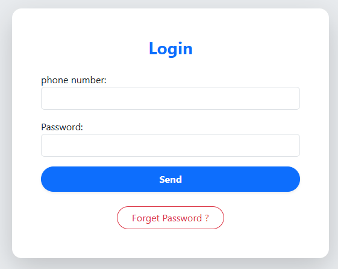
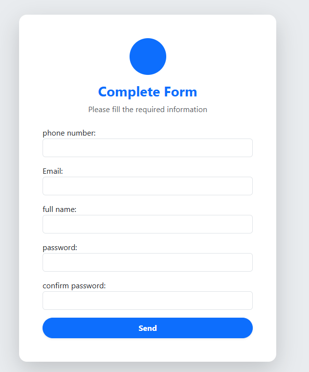
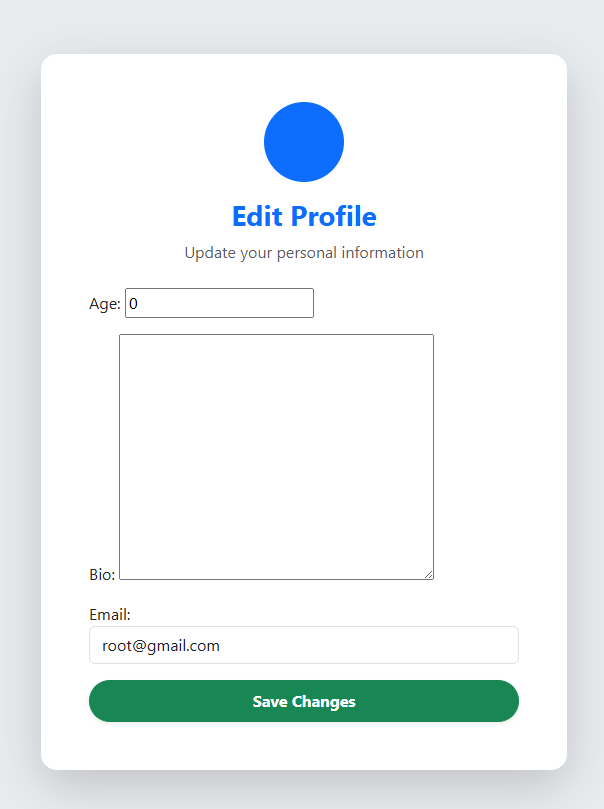

# 📱 Social Media Web Application

A full-featured **Social Media Web Application** built with **Django**.

This project allows users to create accounts, manage profiles, publish posts, interact with other users through likes and comments, and manage their content through a clean and simple web interface.

The application is developed using Django's built-in authentication system and follows a server-side rendered architecture.

---

# 🚀 Features

## 👤 Account System

* User Registration
* User Login & Logout
* Email/OTP Verification
* Password Reset System
* User Profile Management
* Edit Profile
* User Relations

---

## 📝 Post System

* Create Posts
* Update Posts
* Delete Posts
* Post Detail Page
* Upload Images
* Display User Posts
* Media Management

---

## 💬 Interaction System

* Like Posts
* Comment on Posts
* View Comments
* User Interaction Between Profiles

---

## 🎨 Frontend

* Responsive Design
* Django Templates
* Bootstrap Styling
* Static Files Management
* Clean User Interface

---

# 🛠 Technologies

* Python
* Django
* HTML5
* CSS3
* Bootstrap
* SQLite Database
* Git & GitHub

---

# 📂 Project Structure

```text
M/
│
├── account/
│   ├── models.py
│   ├── views.py
│   ├── forms.py
│   ├── managers.py
│   ├── signals.py
│   ├── urls.py
│   └── templates/
│       └── account/
│
├── home/
│   ├── models.py
│   ├── views.py
│   ├── forms.py
│   ├── urls.py
│   └── templates/
│       └── home/
│
├── M/
│   ├── settings.py
│   ├── urls.py
│   ├── wsgi.py
│   └── asgi.py
│
├── templates/
│   ├── base.html
│   └── inc/
│
├── static/
│   └── css/
│
├── media/
│
├── manage.py
├── requirements.txt
├── utils.py
└── README.md
```

---

# ⚙ Installation

## Clone Repository

```bash
git clone https://github.com/your-username/social-media.git
```

Enter project directory:

```bash
cd M
```

---

## Create Virtual Environment

```bash
python -m venv env
```

Activate environment:

### Windows

```bash
env\Scripts\activate
```

### Linux / macOS

```bash
source env/bin/activate
```

---

## Install Dependencies

```bash
pip install -r requirements.txt
```

---

## Database Migration

```bash
python manage.py migrate
```

---

## Create Admin User

```bash
python manage.py createsuperuser
```

---

## Run Project

```bash
python manage.py runserver
```

Open:

```text
http://127.0.0.1:8000/
```

---

# 📸 Screenshots

## 🏠 Home Page

Add screenshot:

```

```

---

## 🔐 Login Page

Add screenshot:

```

```

---

## 📝 Register Page

Add screenshot:

```

```

---

## 👤 User Profile

Add screenshot:

```

```

---

## ✏️ Edit Profile

Add screenshot:

```

```

---

## 📰 Create Post

Add screenshot:

```

```

---

## 📄 Post Detail

Add screenshot:

```

```

---

## 📄 forget password

Add screenshot:

```

```

## 💬 Comments & Likes

Add screenshot:

```

```

---

# 🔮 Future Improvements

* Follow / Unfollow System
* Direct Messaging
* Notifications
* User Search
* Hashtags
* Infinite Scroll
* Dark Mode
* Deploy on VPS

---

# 👨‍💻 Author

**Mohammad Maleki**

Backend Developer

Skills:

```
Python
Django
Django Templates
Database Design
Git
```

GitHub:

```
https://github.com/your-username
```

---

# ⭐ Support

If you like this project, consider giving it a star ⭐ on GitHub.
