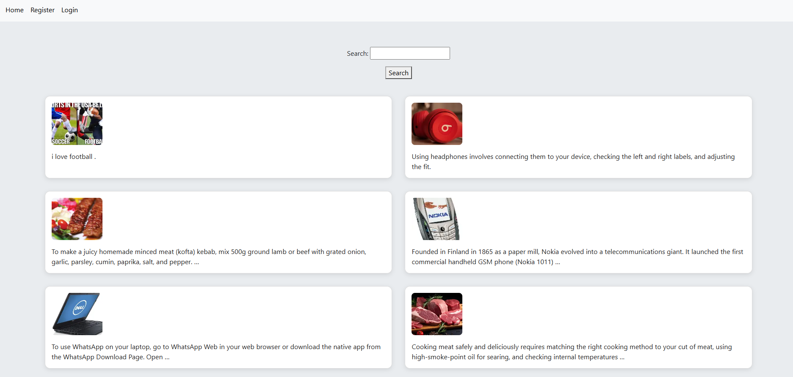
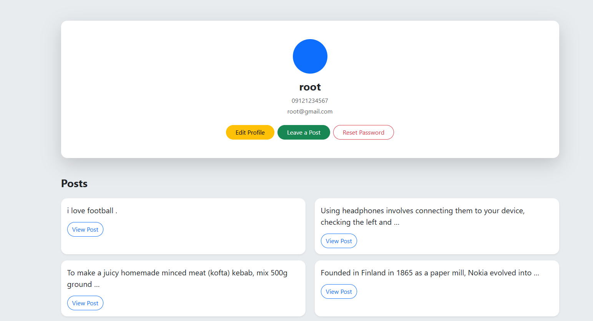
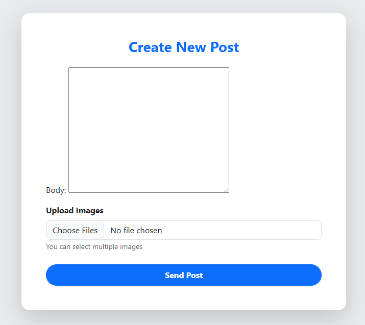
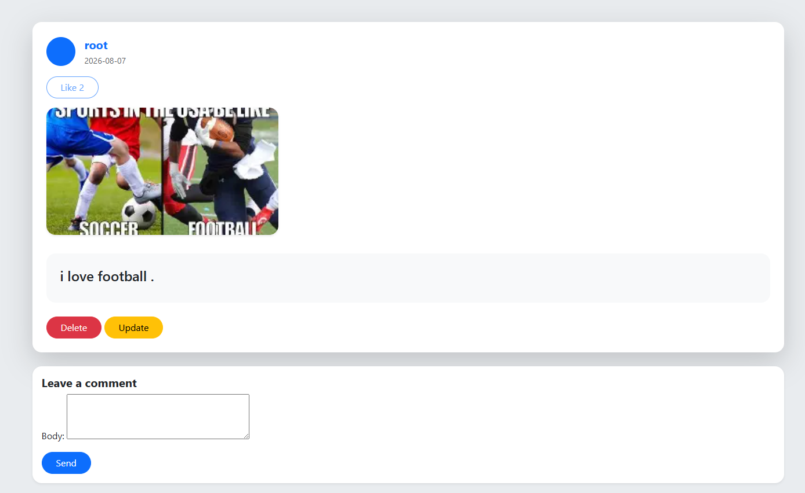
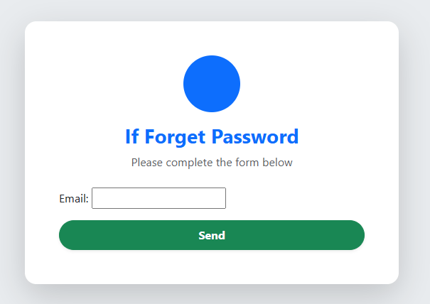

# 📱 Social Media Web Application

A full-featured **Social Media Web Application** built with **Django**.

This project allows users to create accounts, manage profiles, publish posts, interact with other users through likes and comments, and manage their content through a clean and simple web interface.

The application is developed using Django's built-in authentication system and follows a server-side rendered architecture.

---

# 🚀 Features

## 👤 Account System

- User Registration
- User Login & Logout
- Email/OTP Verification
- Password Reset System
- User Profile Management
- Edit Profile
- User Relations

## 📝 Post System

- Create Posts
- Update Posts
- Delete Posts
- Post Detail Page
- Upload Images
- Display User Posts
- Media Management

## 💬 Interaction System

- Like Posts
- Comment on Posts
- View Comments
- User Interaction Between Profiles

## 🎨 Frontend

- Responsive Design
- Django Templates
- Bootstrap Styling
- Static Files Management
- Clean User Interface

---

# 🛠 Technologies

- Python
- Django
- HTML5
- CSS3
- Bootstrap
- SQLite Database
- Git & GitHub

---

# 📂 Project Structure

M/
│
├── account/
│   ├── models.py
│   ├── views.py
│   ├── forms.py
│   ├── managers.py
│   ├── signals.py
│   ├── urls.py
│   └── templates/
│
├── home/
│   ├── models.py
│   ├── views.py
│   ├── forms.py
│   ├── urls.py
│   └── templates/
│
├── M/
│   ├── settings.py
│   ├── urls.py
│   ├── wsgi.py
│   └── asgi.py
│
├── templates/
│   ├── base.html
│   └── inc/
│
├── static/
│   └── css/
│
├── media/
│
├── screenshots/
│   ├── home.png
│   ├── login.png
│   ├── register.png
│   ├── verify-code.png
│   ├── profile.png
│   ├── edit-profile.png
│   ├── create-post.png
│   ├── update-post.png
│   ├── post-detail.png
│   ├── forgot-password.png
│   └── like.png
│
├── manage.py
├── requirements.txt
├── utils.py
└── README.md

---

# ⚙ Installation

## Clone Repository

git clone https://github.com/your-username/social-media.git

cd M

## Create Virtual Environment

python -m venv env

## Activate Virtual Environment

Windows:

env\Scripts\activate

Linux / macOS:

source env/bin/activate

## Install Dependencies

pip install -r requirements.txt

## Database Migration

python manage.py migrate

## Create Admin User

python manage.py createsuperuser

## Run Project

python manage.py runserver

Open in browser:

http://127.0.0.1:8000/

---

# 📸 Screenshots

## 🏠 Home Page

## 🔐 Login Page

## 📝 Register Page

## 👤 User Profile

## ✏️ Edit Profile

## 📰 Create Post

## 📄 Post Detail

## 🔑 Forgot Password

## ❤️ Like System

---

# 🔮 Future Improvements

- Follow / Unfollow System
- Direct Messaging
- Notifications
- User Search
- Hashtags
- Infinite Scroll
- Dark Mode
- Deploy on VPS

---

# 👨‍💻 Author

**Mohammad Maleki**

Backend Developer

Skills:

Python  
Django  
Django Templates  
Database Design  
Git

GitHub:

https://github.com/your-username

---

# ⭐ Support

If you like this project, consider giving it a star ⭐ on GitHub.